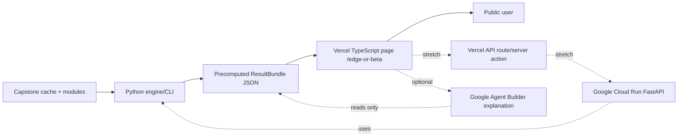

# Design Doc — Edge or Beta?

**Project**: DAMO-699 Capstone — SPY Expiry / S&P 500 signal study  
**Doc type**: implementation design, self-contained handoff spec  
**Date**: 2026-05-25  
**Status**: ready for LLM/developer implementation planning

## 1. Conclusion First

Build **Edge or Beta?** as a public, responsible extension of the capstone: a tool that lets users test whether a “smart” trading rule actually beats three simple baselines after costs:

1. random stock picks on the same dates,
2. random ETF timing,
3. buy-and-hold SPY.

The tool is **not a market predictor**. Its job is to falsify weak trading claims and teach the user to distinguish **alpha** from ordinary market **beta**. The preferred delivery path is:

- **Public UI**: TypeScript page on `https://www.niagaradataanalyst.com/edge-or-beta`, deployed with Vercel.
- **Analytics engine**: deterministic Python package/CLI inside this capstone repo.
- **Poster-ready MVP**: precomputed JSON demos served statically by the Vercel site.
- **Stretch live version**: Vercel calls a Python FastAPI service on Google Cloud Run.
- **Optional Google Agent Builder**: explanation layer only. It must never compute metrics, change verdicts, or generate trading advice.

## 2. Narrative Logic

This tool grows directly from the capstone’s learning path:

1. Literature suggests a real mechanism: options-expiry hedging pressure can create price pressure and reversal around expiry.
2. We believed the mechanism might be tradable and built a rule: RSI oversold + consecutive bearish candles before SPY monthly expiry.
3. The signal initially looked promising: positive returns, positive walk-forward windows, and an intuitive story.
4. Stricter testing showed the usable trading edge did not survive. The return was mostly long-only market beta, not stock-selection alpha.
5. Therefore the public lesson is: before trusting a clever indicator rule, test whether it beats random stock selection, random ETF timing, and simply holding a low-cost ETF.

The product message:

> “When you think your decision is smart, test whether it beats random choices and the market. If it does not, shift from watching indicators to recognizing beta and holding a low-cost ETF.”

## 3. Product Stance

**The tool must say:**

- “This rule has / does not have evidence of alpha under this test.”
- “Most of the return appears to be market beta.”
- “A low-cost ETF may provide the same exposure with lower turnover and complexity.”

**The tool must not say:**

- “Buy this stock.”
- “Sell this stock.”
- “This rule will make money.”
- “AI predicts the market.”
- “Active investing never works.”

Scope discipline matters: the verdict applies only to the selected rule, universe, period, cost assumption, and data limitations.

## 4. Users

Primary users:

- retail investors who rely on simple technical indicators,
- students learning backtesting and market efficiency,
- evaluators reviewing the capstone’s public contribution,
- people exposed to “AI stock prediction” claims who need a reality-check tool.

The UI should be plain, calm, and credible. This is an anti-hype product.

## 5. MVP Versus Full Version

### 5.1 Poster-Ready MVP, 3-Day Target

Deliver a public Vercel page that displays several precomputed demos:

- capstone rule: RSI oversold + consecutive bearish candles near expiry,
- simple RSI rule,
- moving-average crossover rule,
- 12-1 momentum or recent-winner rule,
- optional uploaded-trade-list mock, if time permits.

The Python engine runs offline and exports JSON files such as:

```text
public/edge-or-beta/demo_results/capstone_expiry_rule.json
public/edge-or-beta/demo_results/rsi_30_rule.json
public/edge-or-beta/demo_results/ma_crossover_rule.json
```

The TypeScript UI reads static JSON. This is the safest route for the poster because it avoids server cold-starts, cloud auth, data-loading latency, and API failures.

### 5.2 Live Version, Stretch

Deploy a Python FastAPI service on Google Cloud Run:

```text
POST /evaluate
GET /health
GET /rules
```

The Vercel site calls this service through a server action or API route. The live API should use small defaults for preview speed (`n_null=300`) and allow a “more precise” run (`n_null=1000`) only when latency is acceptable.

### 5.3 Agent Builder, Optional

Google Agent Builder can be used only for:

- explaining the result JSON in plain language,
- glossary / FAQ,
- “why this matters” educational chat,
- guided interpretation for non-technical users.

It must be grounded on the deterministic `ResultBundle`. It must not compute numbers, choose the verdict, alter p-values, or recommend trades.

## 6. Deployment Architecture



Recommended path:

1. Build deterministic Python engine first.
2. Export static JSON demos.
3. Build Vercel TypeScript page.
4. Add Cloud Run only after the static version is stable.
5. Add Agent Builder only after verdict copy is frozen.

## 7. Data Sources

Use the existing capstone cache and modules only. Do not create another independent data pipeline for the MVP.

Important local paths:

```text
cache/constituent_data/<TICKER>.csv
cache/sp500_list.csv
cache/vix.csv
modules/
notebooks/
doc/capstone/final_report.md
```

OHLCV CSV contract:

```text
Date, Symbol, Open, High, Low, Close, Volume
```

Use adjusted/consistent price fields exactly as the existing capstone modules expect. If the data source is survivorship-biased because it uses current S&P 500 constituents, surface that caveat in the UI.

## 8. Inputs

### 8.1 Rule Presets

Support presets first:

- `capstone_expiry_rule`: RSI below threshold + consecutive red candles before SPY monthly expiry.
- `rsi_oversold`: buy when RSI < X.
- `ma_crossover`: short moving average crosses above long moving average.
- `consecutive_red`: N consecutive red candles.
- `momentum_12_1`: simple recent momentum rule.

Each preset must define:

```python
RuleSpec(
    id: str,
    label: str,
    description: str,
    parameters: dict,
    signal_frequency: Literal["daily", "expiry_only"],
    rank_direction: Literal["lower_is_better", "higher_is_better"],
)
```

### 8.2 Custom Trades, Optional

CSV upload schema:

```text
ticker,entry_date
```

or:

```text
ticker,entry_date,exit_date
```

If `exit_date` is absent, use `hold_days`.

### 8.3 Common Parameters

- universe: default S&P 500 from cache,
- start date,
- end date,
- hold days: default 6,
- round-trip cost: default 0.20%,
- top-K per decision date: default 3,
- null iterations: 300 for preview, 1000 for final/static demos,
- random seed: default 42.

## 9. Engine Contract

Create a deterministic Python engine that can run without UI:

```text
tools/edge_or_beta/
  __init__.py
  engine.py
  rules.py
  nulls.py
  decompose.py
  metrics.py
  verdict.py
  export_demo_results.py
  schemas.py
```

Recommended public functions:

```python
def evaluate_rule(
    rule_id: str,
    params: dict,
    universe: list[str],
    start: str,
    end: str,
    hold_days: int = 6,
    commission: float = 0.002,
    top_k: int = 3,
    n_null: int = 1000,
    seed: int = 42,
) -> dict:
    """Return a JSON-serializable ResultBundle."""
```

```python
def evaluate_trade_list(
    trades_csv_path: str,
    start: str | None,
    end: str | None,
    hold_days: int = 6,
    commission: float = 0.002,
    n_null: int = 1000,
    seed: int = 42,
) -> dict:
    """Evaluate user-provided trades with the same baselines."""
```

The engine must be pure and repeatable:

- same inputs + same seed = same output,
- no LLM calls,
- no network calls during evaluation,
- no broker integration,
- no file mutation except explicit JSON export commands.

## 10. ResultBundle Schema

Every implementation should return this shape. Extra fields are allowed, but these are required.

```json
{
  "schema_version": "1.0",
  "run_id": "string",
  "created_at": "ISO-8601",
  "rule": {
    "id": "capstone_expiry_rule",
    "label": "RSI oversold + consecutive red candles",
    "params": {}
  },
  "settings": {
    "universe": "sp500_current_cache",
    "start": "2015-01-01",
    "end": "2026-05-22",
    "hold_days": 6,
    "commission": 0.002,
    "top_k": 3,
    "n_null": 1000,
    "seed": 42
  },
  "data_quality": {
    "tickers_requested": 510,
    "tickers_used": 492,
    "trades": 135,
    "warnings": [
      "Current S&P 500 cache is not point-in-time; survivorship bias may remain."
    ]
  },
  "strategy": {
    "cagr": 0.091,
    "sharpe": 0.6,
    "win_rate": 0.56,
    "profit_factor": 1.2,
    "max_drawdown": 0.31,
    "composite": 0.56,
    "equity_curve": [{"date": "2015-01-01", "value": 1.0}]
  },
  "benchmarks": {
    "random_stock_same_dates": {
      "metric": "cagr",
      "mean": 0.094,
      "median": 0.090,
      "p_value": 0.58,
      "percentile": 42,
      "distribution": [0.01, 0.02]
    },
    "random_etf_timing": {
      "metric": "cagr",
      "mean": 0.102,
      "median": 0.101,
      "p_value": 0.71,
      "percentile": 29,
      "distribution": [0.01, 0.02]
    },
    "buy_hold_spy": {
      "cagr": 0.119,
      "sharpe": 0.78,
      "max_drawdown": 0.24,
      "equity_curve": [{"date": "2015-01-01", "value": 1.0}]
    }
  },
  "decomposition": {
    "alpha_annualized": 0.0,
    "alpha_t": 0.3,
    "alpha_p": 0.76,
    "beta": 1.05,
    "beta_share": 0.96,
    "method": "trade_window_capm"
  },
  "verdict": {
    "status": "no_evidence_of_edge",
    "headline": "No evidence this rule beats holding a low-cost ETF.",
    "headline_zh": "没有证据表明这条规则比持有低成本 ETF 更好。",
    "reasons": [
      "It did not beat random stock picks on the same dates.",
      "It did not beat random ETF timing.",
      "Alpha is not statistically significant."
    ]
  }
}
```

## 11. Correct Null Tests

This is the analytical heart of the tool.

### 11.1 Random Stock Same-Dates Null

Purpose: test stock-selection skill.

For each iteration:

1. Keep the strategy’s actual entry dates.
2. For each entry date, draw a random eligible ticker from the universe.
3. Eligibility means valid price data exists at entry and exit.
4. Apply the same hold period, cost, and portfolio aggregation.
5. Compute the same headline metric as the strategy.

P-value convention:

```text
p_select = mean(null_metric >= strategy_metric)
```

Lower p-value means the rule beat most random same-date stock selections.

### 11.2 Random ETF Timing Null

Purpose: test timing skill.

For each iteration:

1. Draw the same number of random SPY entry dates from the analysis span.
2. Use the same hold period and cost.
3. Compute the same headline metric.

P-value convention:

```text
p_timing = mean(null_metric >= strategy_metric)
```

### 11.3 Buy-And-Hold SPY

Purpose: test whether active trading beats doing nothing.

Use SPY over the same start/end range. Prefer adjusted/consistent close as available in the project cache. Show CAGR, Sharpe, max drawdown, and equity curve.

### 11.4 Do Not Use Return-Shuffle as the Public Null

Do **not** implement the public null by shuffling the selected trades’ `net_return` vector.

The capstone report explains why that test is degenerate for the composite score: Profit Factor, Sharpe, and Win Rate are order-invariant; only Max Drawdown changes, and the drawdown component can saturate. Return-shuffle can remain a path-dependence diagnostic, but it is not a selection-skill test.

The public tool’s contribution is to implement the correct random-entry resampling that the capstone identified as future work.

## 12. Metrics

Required metrics:

- CAGR,
- Sharpe,
- win rate,
- profit factor,
- max drawdown,
- composite score, if reused from the capstone,
- trade count,
- average return per trade,
- cost assumption.

Use CAGR as the main user-facing comparison because it is intuitive. Use alpha t-stat and p-values as the rigor layer.

If a strategy has fewer than 30 trades, show a strong sample-size warning. If fewer than 10 trades, do not show a confident verdict; use `status = "insufficient_sample"`.

## 13. Alpha/Beta Decomposition

For each strategy trade, compute matched SPY return over the same entry-to-exit window.

Regression:

```text
r_strategy = alpha + beta * r_spy + error
```

Report:

- annualized alpha,
- alpha t-stat,
- alpha p-value,
- beta,
- beta share.

`beta_share` is a communication helper, not the formal statistical test. Suggested calculation:

```python
if strategy_cagr > 0 and spy_cagr > 0:
    beta_share = min(max((beta * spy_cagr) / strategy_cagr, 0), 1)
else:
    beta_share = None
```

If `beta_share` is `None`, use copy like:

> “Because the rule’s return is negative or near zero, beta share is not meaningful.”

This is a trade-level CAPM approximation. If the strategy has many overlapping positions,
trade residuals can be serially correlated, which makes plain OLS standard errors too small
and can overstate `alpha_t`. The stricter implementation should also run the same regression on
a daily portfolio-return series with heteroskedasticity/autocorrelation-robust standard errors.
Until that exists, display trade-level `alpha_t` as suggestive rather than definitive.

## 14. Verdict Logic

Default thresholds:

```text
beat_random_stock = p_select < 0.05
beat_random_etf = p_timing < 0.05
beat_spy = strategy_cagr > spy_cagr
significant_alpha = alpha_t >= 2.0 and alpha_annualized > 0
```

Verdict statuses:

```text
insufficient_sample
no_evidence_of_edge
mostly_beta
beats_random_but_not_spy
candidate_edge_needs_validation
```

Suggested logic:

```python
if trade_count < 10:
    status = "insufficient_sample"
elif beat_random_stock and beat_random_etf and beat_spy and significant_alpha:
    status = "candidate_edge_needs_validation"
elif beat_random_stock and beat_random_etf and not beat_spy:
    status = "beats_random_but_not_spy"
elif beta_share is not None and beta_share >= 0.75:
    status = "mostly_beta"
else:
    status = "no_evidence_of_edge"
```

Even when the rule passes, copy must remain cautious:

> “This is a candidate edge under this historical test, not a prediction or trading recommendation.”

## 15. User-Facing Copy

### 15.1 Typical Failed Rule, English

> **Verdict: no evidence this rule beats holding a low-cost ETF.**  
> After costs, it did not beat random stock picks on the same dates, did not beat random ETF timing, and did not produce statistically significant alpha. Most of the return appears to be ordinary market beta.

### 15.2 Typical Failed Rule, Chinese

> **判决：没有证据表明这条规则比持有低成本 ETF 更好。**  
> 扣除成本后，它没有跑赢同日期随机选股，也没有跑赢随机买入 ETF；alpha 也不显著。你的收益主要来自大盘上涨，而不是这条规则本身。

### 15.3 Mostly Beta, Chinese

> **判决：这更像 beta，不像 alpha。**  
> 规则看起来赚钱，但大部分收益可以由市场整体上涨解释。与其频繁看指标，不如先认真比较低成本指数 ETF。

### 15.4 Candidate Edge, Chinese

> **判决：这条规则在本次历史检验中表现优于三个对照，但仍需要样本外验证。**  
> 这不是买卖建议，也不是未来收益预测。请继续检查更多年份、更高交易成本、不同市场环境和样本外表现。

## 16. TypeScript/Vercel UI Plan

Target URL:

```text
https://www.niagaradataanalyst.com/edge-or-beta
```

Recommended page sections:

1. compact title: “Edge or Beta?”
2. one-sentence thesis,
3. rule selector,
4. headline verdict block,
5. three-baseline comparison table,
6. equity curve versus SPY,
7. random-stock null histogram,
8. beta/alpha decomposition,
9. caveats and methodology accordion,
10. link back to capstone report.

The page should feel like a tool, not a landing page. Avoid hype language and avoid “AI-powered” framing.

Static JSON page behavior:

- load available demo files at build time or from `/public/edge-or-beta/demo_results/`,
- switch displayed `ResultBundle` when user changes rule,
- no user data persistence,
- no accounts,
- no trading links.

## 17. Google Cloud Plan

Use Google Cloud only if live evaluation is needed.

Recommended service:

```text
Cloud Run
Python 3.11
FastAPI
Memory: 1-2 GB minimum
CPU: 1-2
```

Endpoint:

```http
POST /evaluate
Content-Type: application/json
```

Request:

```json
{
  "rule_id": "rsi_oversold",
  "params": {"rsi_threshold": 30},
  "start": "2015-01-01",
  "end": "2026-05-22",
  "hold_days": 6,
  "commission": 0.002,
  "top_k": 3,
  "n_null": 300,
  "seed": 42
}
```

Response: `ResultBundle`.

Performance requirements:

- warm request target: under 30 seconds for `n_null=300`,
- static demos should use `n_null=1000`,
- cache parsed price data in memory after first request,
- reject unsupported rules instead of generating arbitrary code.

## 18. LLM / Agent Rules

Any LLM implementing or explaining this tool must follow these rules:

1. Deterministic Python computes all metrics.
2. LLMs may summarize, translate, or explain only after metrics are computed.
3. LLMs must not invent missing results.
4. LLMs must not turn the verdict into buy/sell advice.
5. LLMs must preserve uncertainty, sample-size warnings, cost assumptions, and survivorship caveats.
6. LLMs must read this design doc before implementation.

Minimax or other low-cost models can help with:

- frontend copy variants,
- translating verdict copy,
- generating rough preset descriptions,
- checking UI text for clarity,
- drafting FAQ.

Codex / higher-reasoning models should own:

- engine design,
- null-test correctness,
- schema decisions,
- statistical interpretation,
- final quality review.

## 19. Tests and Acceptance Criteria

### 19.1 Engine Tests

Required unit tests:

- same seed gives identical null distributions,
- random-stock null keeps dates fixed and changes tickers,
- random ETF null uses only SPY,
- cost lowers returns relative to zero-cost run,
- insufficient sample returns `insufficient_sample`,
- p-value convention is `mean(null >= observed)`,
- `ResultBundle` is JSON serializable,
- capstone preset produces trade counts and core metrics consistent with the report within tolerance.

### 19.2 UI Acceptance

The Vercel page passes when:

- it loads without server dependency in static MVP mode,
- each demo rule switches correctly,
- the three baselines are visible above the fold on desktop,
- mobile layout is readable,
- caveats are visible,
- no copy implies prediction or guaranteed profit,
- screenshot is poster-ready.

### 19.3 Report/Notebook Alignment

The capstone report and notebook should say:

- the original Monte Carlo was a return-shuffle/permutation diagnostic,
- it is degenerate for the composite and should not be described as a random-entry test,
- the no-edge conclusion rests on H2 large-sample evidence, H3 ML evidence, and beta-vs-alpha interpretation,
- Edge or Beta implements the correct random-entry resampling as a public extension.

## 20. Poster Integration

Use one small poster panel:

Title:

```text
From Indicators to Index: Edge or Beta?
```

Panel message:

> Our rule looked smart until strict testing showed the return was mostly beta. We turned that lesson into a public tool: test any rule against random stock picks, random ETF timing, and holding SPY.

Show:

- verdict screenshot,
- QR code to `/edge-or-beta`,
- one sentence: “Most simple rules do not beat beta after costs.”

This panel should support the capstone, not replace it.

## 21. Implementation Task Plan

### Track A — Python Engine

1. Create `tools/edge_or_beta/`.
2. Implement schemas and metrics wrappers.
3. Implement rule registry.
4. Implement correct random-entry nulls.
5. Implement CAPM alpha/beta decomposition.
6. Implement verdict logic.
7. Export static demo JSON files.
8. Add unit tests.

### Track B — Vercel TypeScript Page

1. Add `/edge-or-beta` route to `niagaradataanalyst.com`.
2. Define TypeScript types matching `ResultBundle`.
3. Load static demo JSON.
4. Build verdict block, comparison table, equity chart, null histogram, decomposition view.
5. Add methodology/caveat accordion.
6. Add capstone report link and QR target.

### Track C — Cloud Run, Optional

1. Wrap engine in FastAPI.
2. Add `/health`, `/rules`, `/evaluate`.
3. Deploy to Cloud Run.
4. Add Vercel proxy/server action.
5. Add request limits and timeouts.

### Track D — Agent Builder, Optional

1. Ground agent on this design doc and `ResultBundle` schema.
2. Restrict it to explanations and FAQ.
3. Add “explain this result” button only after deterministic results render.

## 22. Known Risks

- **Survivorship bias**: current S&P 500 cache is not point-in-time.
- **Latency**: live null resampling may be slow without preloaded price data.
- **Overclaiming**: the UI must avoid turning a failed-rule checker into another prediction app.
- **Small samples**: many custom rules will have too few trades for strong conclusions.
- **Static MVP limitation**: users can inspect demos but not run arbitrary rules until Cloud Run is added.

## 23. Final Product Principle

This tool wins by being more honest than a prediction demo:

> It does not promise users they can beat the market. It helps them test whether they are fooling themselves.
